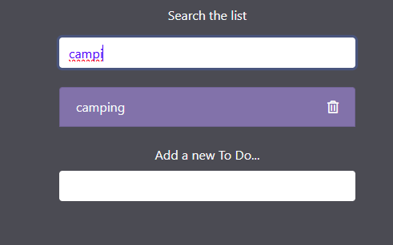
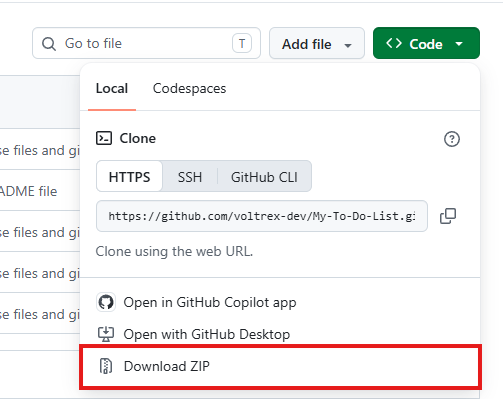

# Summary
This project is a to-do list. You can make a list of things you want to track.
## Features 
* **Search** the list for items
* **Delete** items from the list
* *Interactive* search for items

### Downloading or using
This is my live website
[LiveWebSite](https://voltrex-dev.github.io/My-To-Do-List/)

**Here's how to download**
## You can either *Clone* the repo or *download* as zip 
1. Clone: git clone https://github.com/voltrex-dev/My-To-Do-List.git
2. Download
